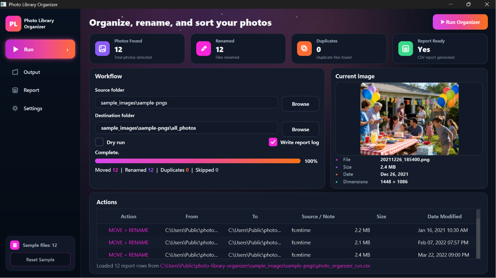

# `Photo Library Organizer`

Photo Library Organizer is a Python desktop utility for organizing, renaming, previewing, and reporting on photo libraries. It includes dry-run support, CSV report output, image preview, and an in-app actions log.



**Tech stack:** Python · Desktop UI · File Automation · CSV Reports · Image Preview

**No re-encoding. No quality loss.**  
Files are only **moved and renamed**.

---

## Features

- Organize and rename photo files
- Preview selected images inside the app
- Run in dry-run mode before changing files
- Generate CSV report logs
- Review planned/completed actions in an in-app table
- Browse output and report views from the sidebar
- Includes sample files for local testing

---

## What it does

- Scans a drive or folder for photos & videos
- Reads capture timestamps using **ExifTool**
- Renames files to a consistent format: YYYYMMDD_HHMMSS.ext


- Avoids filename collisions (`_01`, `_02`, …)
- Detects **exact duplicates** (timestamp + size → optional SHA-256)
- Moves duplicates into `_DUPLICATES/`
- Supports excluding folders
- Optional: organize everything into `YYYY/` year folders
- Shows real-time progress and writes a CSV log

---

## Supported formats

Photos:
- JPG / JPEG
- PNG
- CR2 (Canon RAW)
- DNG
- GIF

Videos:
- MP4
- MOV
- AVI
- 3GP

Excluded:
- `.AAE` (iPhone edit sidecars)

---

## Requirements

- Python **3.10+**
- **ExifTool** (recommended)
- Optional UI: **PySide6 Essentials**

Install the desktop UI dependency. The project uses `PySide6-Essentials` so it only installs the Qt modules needed by the app instead of the much larger Addons package.

```powershell
pip install -r requirements.txt
```

### Install ExifTool (Windows)
1. Download from https://exiftool.org/
2. Extract `exiftool(-k).exe`
3. Rename it to `exiftool.exe`
4. Place it next to `bulk_image_rename.py`  
   *(or add it to your PATH)*

---

## Usage

### Desktop UI
```powershell
python photo_organizer_ui.py
```

The UI opens on the included `sample_images/sample-pngs` demo set by default. Use **Dry run** to preview the organizer, uncheck it to run the sample for real, and use **Reset Sample** to restore the demo files.

The desktop UI provides a native dashboard for configuring dry runs, duplicate handling, report logs, year-folder organization, and launching the real organizer script.

### Dry run (always do this first)
```powershell
python -u bulk_image_rename.py "E:\" --dry-run --log-csv dry_run.csv
```

### Real run
```powershell
python -u bulk_image_rename.py "E:\" --log-csv run.csv
```

### Exclude Folders
```powershell
python -u bulk_image_rename.py "E:\" --exclude "Private" --exclude "Backups"
```

### Consolidate + Organize by Year
```powershell
python -u bulk_image_rename.py "E:\" --log-csv run.csv --organize-by-year
```

---
## Safety notes

Do not open File Explorer in the source folders while running
(Explorer previews can lock files)

- This tool:

 - does NOT re-encode

 - does NOT modify EXIF

 - does NOT resize or compress

- All actions are logged to CSV


---
## Output

```yaml
ROOT/
  all_photos/
    2020/
    2021/
    ...
    _DUPLICATES/
```

---

A static browser mockup is also included in `web/` if you want a quick web screenshot.

Open `web/index.html` in a browser, or serve it locally:

```powershell
python -m http.server 8000 -d web
```


---
## License

MIT
